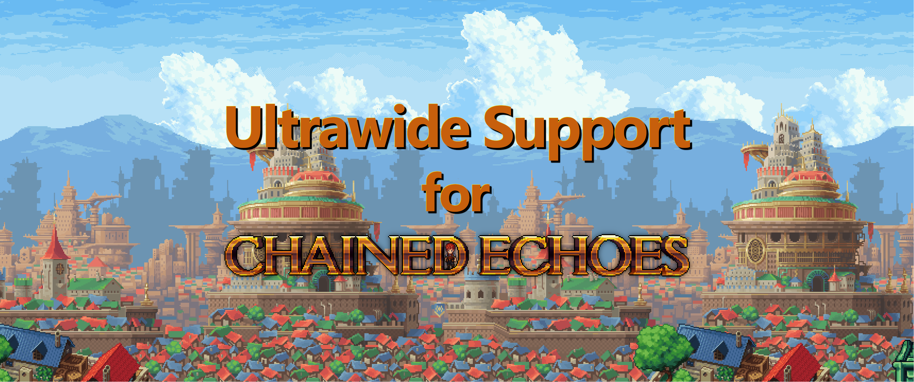

# Ultrawide Support for Chained Echoes

Ever wished you could play Chained Echoes in ultrawide? Well, now you can!

## Features

-   Unlocks ultrawide resolutions for Chained Echoes!
-   **ZERO CONFIGURATION REQUIRED!** Simply install and you'll have ultrawide unlocked with ease! Ultrawide Support automatically detects the optimal resolution for your monitor and forces the game to adjust to its aspect ratio at runtime.

## WARNING

Chained Echoes was **_NOT_** meant to be played like this. You **_WILL_** see things the developers did not intend! For example UI elements that aren't supposed to be seen, sudden immersion-breaking map edges where sprites were only half-drawn by the devs, and potentially even spoilers where what were once off-screen characters are just standing on the edges waiting for their moment, plain for you to see!

When it comes to the UI elements, I am attempting to resolve these to the best of my abilities, but please note that there's gonna be things I've missed - especially since I've not began the journey to Tormund yet! I'll be making updates and fixes as I play through the game, **so check back regularly for updates!**

## Installation

1. Install [BepInEx for Chained Echoes](https://github.com/toebeann/BepInEx.ChainedEchoes)

    BepInEx is a mod loader for Chained Echoes

2. Download and extract the contents of `Ultrawide Support.zip` into `<game folder>\BepInEx`.

    If you did it right, `Tobey.ChainedEchoes.UltrawideSupport.dll` should be located within `<game folder>\BepInEx\plugins`.

3. Launch the game and have fun!
